# 基于Springboot的师生健康信息管理系统

## Springboot-0041


## 技术栈

Springboot mybatisplus vue mysql maven


## 数据库表(12张)


## 功能介绍

```properties
管理员：个人中心、学生管理、教师管理、数据收集管理、问卷分类管理、疫情问卷管理、问卷调查管理、返校信息管理、数据采集管理、返校情况管理；学生管理系统：个人中心、数据收集管理、疫情问卷管理、返校信息管理，教师系统管理：个人中心、疫情问卷管理、数据采集管理、返校情况管理等功能。
```


## 图片

### 前台

### 后台


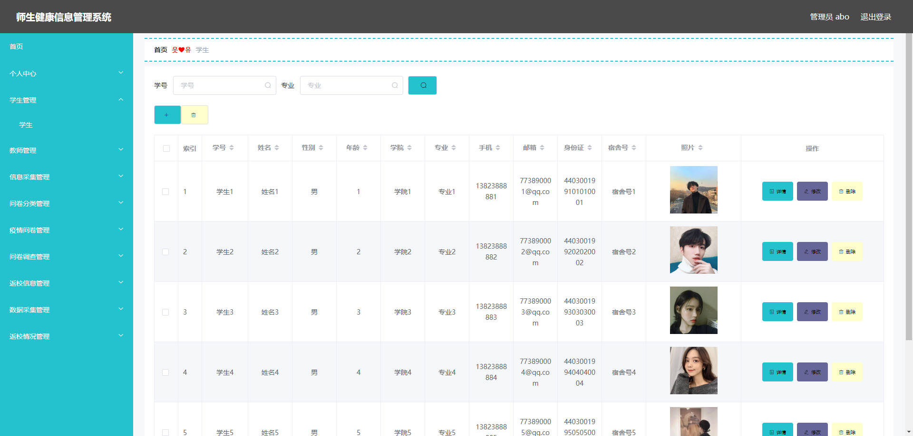

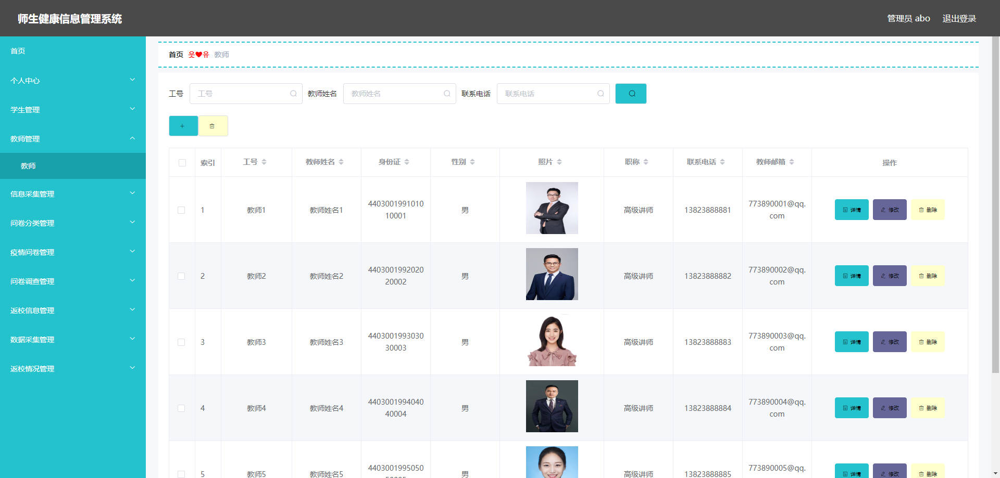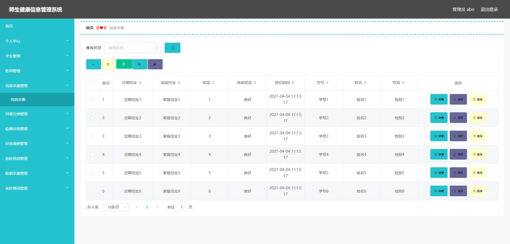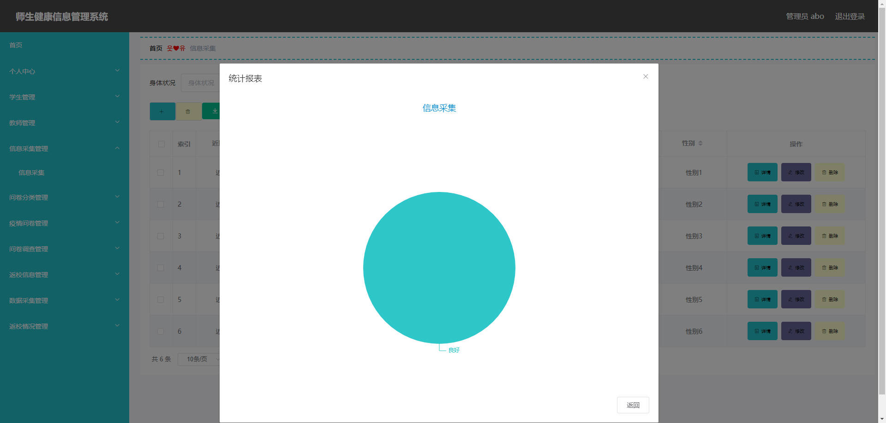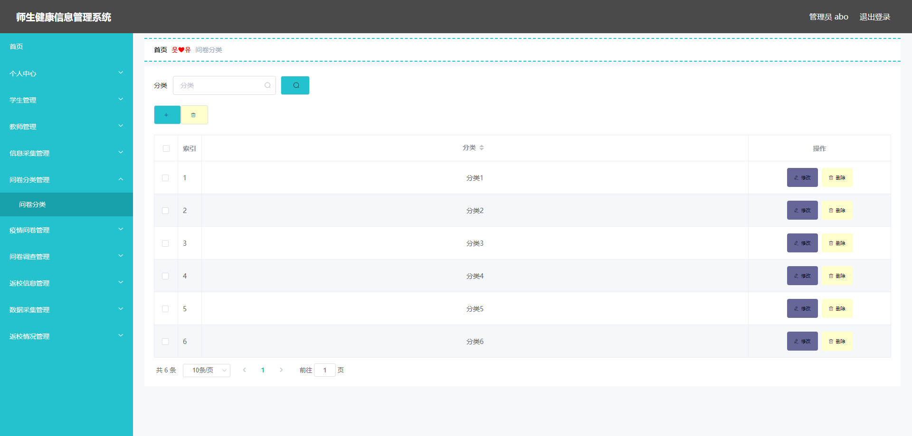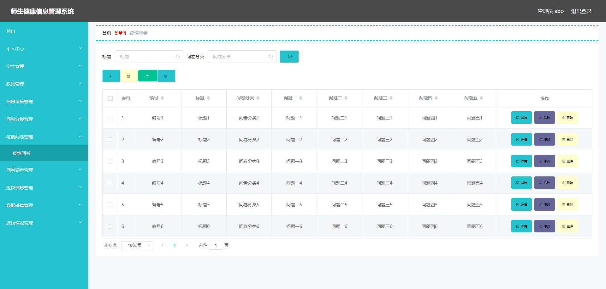

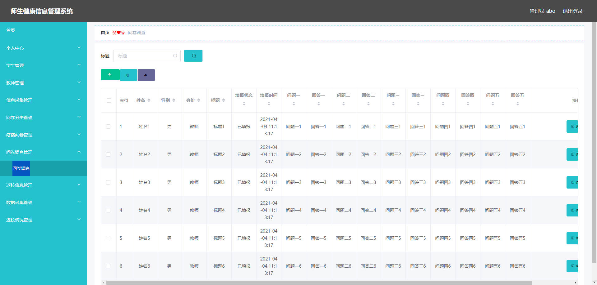

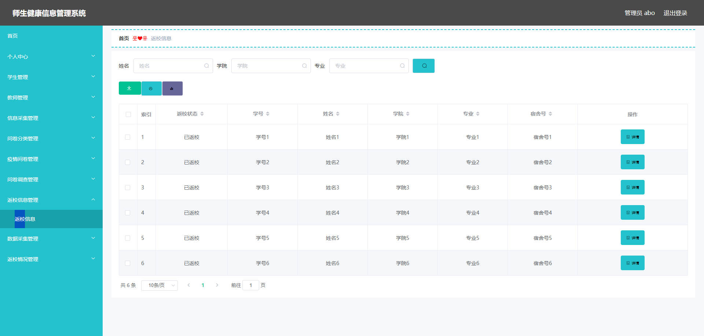

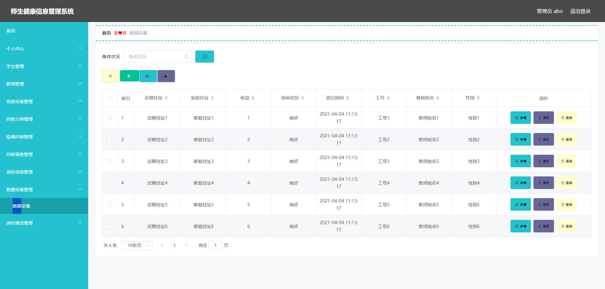

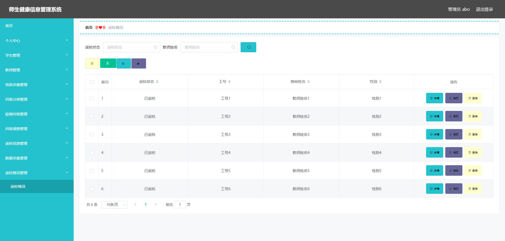


## 访问路径

### 前台

```properties

```

### 后台

```properties
http://localhost:8080/springboot43q56/admin/dist/index.html#/login

账号 abo
密码 abo
```


## 功能图

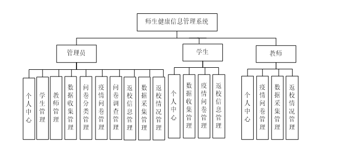


## 文档目录

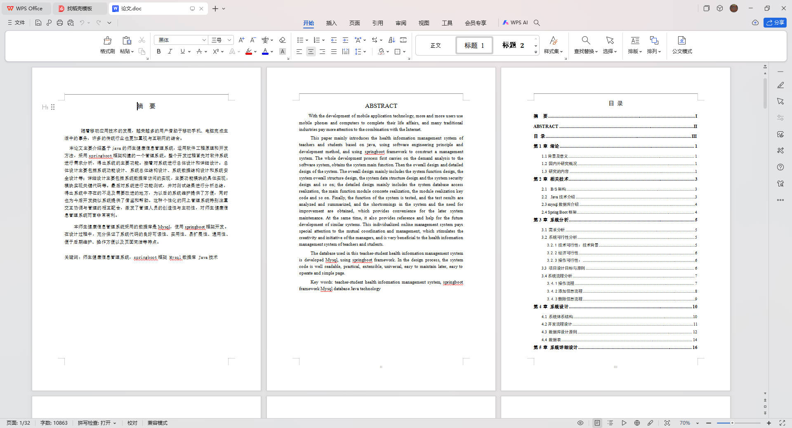


## 打赏或交流


